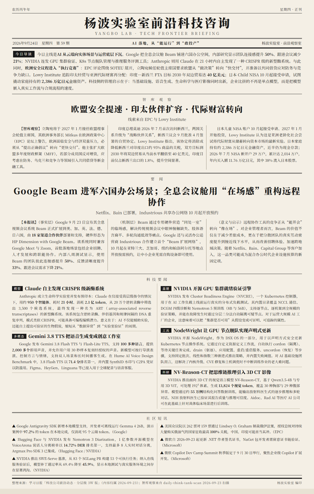

# frontier-daily-brief

**中文** | [English](#english)

智库 + 科技前沿每日扫描，自动生成报纸版式日报图片的自动化流程。
Daily scanning of think tanks & tech frontier sources, generating newspaper-style daily briefing images.



---

## 中文

一套基于 Playwright 的自动化流程：每日扫描你配置的智库与科技公司页面，筛选当日新发布的内容，登记成 CSV 与日报 markdown，最终整合生成一张报纸版式的高清 PNG 日报图。

### 学术分享

本 Skill 于 2026 年 9 月 23 日在**中国人民大学**「从“有想法”到“好案例”：Coding Agent 如何重塑案例写作、研究与评阅」工作坊中作为核心实战案例分享。工作坊由中国社会科学案例中心与信息学院案例中心联合主办，信息学院 AI Plus 中心主任、案例中心主任**杨波教授**与信息学院管理科学与工程专业博士生**李瑞洋**联合主讲。[讲座预告](https://mp.weixin.qq.com/s/V2qrBMkqKjsL_9j71S8QJw)

### 设计思路

- **人定目标、AI 交付、人来验收**：不再一步步教 AI 操作，而是给出目标、约束与验收标准，由 Agent 自主拆解、执行、自纠，人只做最终验收；验收满意的流程随即固化为 Skill。
- **经验在积累，而非流失**：监控源先由 Chatbot 提名、Coding Agent 实地验证可抓取，再将固定操作脚本化；每次 AI 做错，教训当场补回 Skill——这是 Skill 与口头交代最本质的区别。
- **双流水线分层筛选**：智库线与科技线独立运行，Track A/B 按内容深度分级；一条线跑通后整体迁移复制第二条线，不重复造轮子。
- **流式编排，省 token**：从「一次加载全部原文」改为「读一篇、处理一篇、登记一篇」，深查阶段只取元数据，把上下文成本压到最低。
- **可核验交付**：信息登记 log 逐条附原始链接，供人工核验溯源；针对国外源站的跨洋时滞，发布日期按搜集日期 +1 天对齐。

### 核心优势：官网一手信源，全程可溯源

- **只抓一手，不采二手**：所有内容直接抓取自机构与公司的**官方网站**（研究出版页、官方博客、新闻稿），不依赖媒体转载、内容聚合平台或社交媒体上的二手痕迹与杂糅信息——日报里读到的每一条，都对应发布方官网的原文。
- **条条件可溯源**：每篇收录在登记 CSV 中附官网原始链接，任何结论可一键回查原文，满足科研引用与智库写作的核验要求。
- **质量上限取决于你的 List**：日报的信息丰富度由监控列表决定——`config/*.json` 里填的源越全、越准，日报越有价值；流水线本身不设信息天花板。

### 日常使用：一句话 Prompt

在 Coding Agent（Kimi Code / Claude Code 等）中打开本文件夹，输入：

> 进行 YYYY 年 MM 月 DD 日的智库和科技搜索

Agent 会按 [SKILL.md](SKILL.md) 自动执行完整流水线：浅扫 → 深查 → 保存原文 → 登记 → 整合成稿 → 出图。无需记忆任何命令；需要精细控制时，也可按 SKILL.md 手动逐步运行脚本。

### 交付物

| 层级 | 交付物 | 位置 | 说明 |
|---|---|---|---|
| **最终** | 日报图片 PNG | `tech-learning-scan/Daily Picture/daily-news-<发布日期>.png` | 报纸版式成稿，可读性强，可直接分享 |
| 中间 | 日报笔记 markdown | `*/scans/daily-scan-<date>.md`、`daily-learn-<date>.md` | 按 5W1H 框架分析的当日结构化笔记 |
| 中间 | 抓取原文 txt | `*/raw-reports/<date>/` | 每篇文章全文存档，供回读核查 |
| 中间 | 信息登记 CSV | `*/assets/*.csv` | 逐条附原始链接，供人工核验溯源 |
| 中间 | 深查元数据 JSON | `*/scans/deep_check_report_<date>.json` | 候选文章的日期、字数、PDF 链接等元数据 |

### 功能特性

- **两条独立流水线**
  - `daily-think-tank-scan/`：智库 / 研究机构（Track A：≥8000 字研究报告；Track B：涉华评论分析）
  - `tech-learning-scan/`：科技公司研究出版物与博客（Track A：论文/报告；Track B：博客/新闻）
- **四步流程**：浅扫列表页 → 深查候选文章（核实真实发布日期、字数、涉华提及、PDF 链接）→ 保存原文 txt → CSV 登记 + 生成日报 markdown
- **报纸版式出图**：`generate_daily_picture.py` 将两份日报整合为报纸版式 HTML，再用 Playwright 截图为 1200px 高清 PNG（导读 / 智库观察 / 要闻 / 科技要闻 / 社区短讯 五个版块）
- **省 token 设计**：深查只记录元数据，登记逐篇处理，不一次性加载全部原文
- **配置驱动**：监控目标全部来自 `config/*.json`，按需增删，代码零改动

### 快速开始

```bash
pip install playwright
playwright install chromium
```

1. 按 [config/list-format.md](config/list-format.md) 的格式填写 `config/think_tank_list.json` 与 `config/tech_company_list.json`（仓库内为空白模板）
2. 运行智库流水线（`daily-think-tank-scan/`）与科技流水线（`tech-learning-scan/`）各自的四个脚本
3. 按 [draft-template.md](tech-learning-scan/Daily%20Picture/draft-template.md) 整合成稿，运行 `python scripts/generate_daily_picture.py <搜集日期>` 出图

### 目录结构

```
├── config/                     # 监控列表（空白模板）
├── daily-think-tank-scan/      # 智库流水线（scripts + assets/scans/raw-reports 输出目录）
├── tech-learning-scan/         # 科技流水线（scripts + Daily Picture 出图）
├── SKILL.md                    # 完整使用文档
└── README.md
```

Track A/B 详细定义、已知限制与扩展建议见 [SKILL.md](SKILL.md)。

---

## English

A Playwright-based automation pipeline that scans your configured think-tank and tech-company pages every day, filters content published on the target date, registers everything into CSVs and daily markdown reports, and finally composes a newspaper-style high-resolution PNG briefing.

### Featured Presentation

This skill was presented as a core hands-on case at the workshop **"From Ideas to Deliverables: How Coding Agents Reshape Case Writing, Research, and Review"** at **Renmin University of China** on September 23, 2026. The workshop was co-hosted by the China Social Sciences Case Center and the School of Information Case Center, and co-delivered by **Prof. Bo Yang** (Director of the AI Plus Center and the Case Center, School of Information) and **Ruiyang Li** (Ph.D. candidate in Management Science and Engineering, School of Information). [Event announcement (Chinese)](https://mp.weixin.qq.com/s/V2qrBMkqKjsL_9j71S8QJw)

### Design Philosophy

- **Human sets the goal, AI delivers, human accepts**: instead of instructing AI step by step, you define the goal, constraints, and acceptance criteria; the agent plans, executes, and self-corrects — and any workflow that passes acceptance is then codified into a Skill.
- **Experience compounds instead of leaking**: watch-list sources are first proposed by a chatbot, then verified by a Coding Agent for actual scrapability, and stable operations are scripted; whenever the AI gets something wrong, the lesson is written back into the Skill — the essential difference between a Skill and verbal instructions.
- **Two pipelines with tiered filtering**: the think-tank and tech pipelines run independently, with Track A/B graded by content depth; once one pipeline works, it is cloned and adapted into the second — no reinventing the wheel.
- **Streaming orchestration for token efficiency**: instead of loading all raw articles at once, articles are read, processed, and registered one by one; the deep-check stage records metadata only.
- **Verifiable deliverables**: every registry entry carries its original URL for human verification; to handle the trans-Pacific time lag of overseas sources, the publication date is aligned to scan date + 1 day.

### Core Strength: First-Hand Sources, Fully Traceable

- **First-hand only, never second-hand**: all content is scraped directly from the **official websites** of institutions and companies (research publication pages, official blogs, press releases) — never from media reprints, content aggregators, or social-media traces. Every item in the briefing corresponds to the publisher's original page.
- **Every entry traceable**: each registered item carries its official URL in the CSV registry, so any claim can be checked against the original source with one click — meeting the verification bar for academic research and think-tank writing.
- **Quality is bounded by your watch list**: the richness of the briefing depends on how comprehensive and well-chosen your `config/*.json` watch lists are; the pipeline itself imposes no ceiling on information quality.

### Daily Use: One Prompt

Open this folder in a Coding Agent (Kimi Code, Claude Code, etc.) and type:

> Run the think-tank and tech scan for YYYY-MM-DD（进行某月某日的智库和科技搜索）

The agent then follows [SKILL.md](SKILL.md) to execute the full pipeline: shallow scan → deep check → save raw text → register → compose the draft → render the image. No commands to memorize; for fine-grained control, you can still run the scripts step by step as documented in SKILL.md.

### Deliverables

| Level | Deliverable | Location | Notes |
|---|---|---|---|
| **Final** | Daily briefing PNG | `tech-learning-scan/Daily Picture/daily-news-<publish-date>.png` | Newspaper-style page, highly readable, ready to share |
| Intermediate | Daily notes markdown | `*/scans/daily-scan-<date>.md`, `daily-learn-<date>.md` | Structured notes analyzed with the 5W1H framework |
| Intermediate | Raw article text | `*/raw-reports/<date>/` | Full-text archive of every article for re-reading |
| Intermediate | Registry CSVs | `*/assets/*.csv` | One row per item with original URLs for human verification |
| Intermediate | Deep-check metadata JSON | `*/scans/deep_check_report_<date>.json` | Candidate metadata: date, word count, PDF link, etc. |

### Features

- **Two independent pipelines**
  - `daily-think-tank-scan/`: think tanks / research institutions (Track A: research reports ≥ 8,000 words; Track B: China-related commentary)
  - `tech-learning-scan/`: tech company research publications & blogs (Track A: papers/reports; Track B: blog/news posts)
- **Four-step flow**: shallow scan of list pages → deep check of candidate articles (true publication date, word count, China mentions, PDF link) → save raw text → CSV registry + daily markdown report
- **Newspaper-style rendering**: `generate_daily_picture.py` merges both reports into a newspaper-layout HTML and screenshots it into a 1200px PNG (lead / think-tank watch / headline / tech news / community briefs)
- **Token-saving design**: deep check records metadata only; registration processes articles one by one instead of loading everything at once
- **Config-driven**: all monitored targets live in `config/*.json` — add or remove sources without touching code

### Quick Start

```bash
pip install playwright
playwright install chromium
```

1. Fill in `config/think_tank_list.json` and `config/tech_company_list.json` following [config/list-format.md](config/list-format.md) (blank templates included)
2. Run the four scripts of each pipeline (`daily-think-tank-scan/` and `tech-learning-scan/`)
3. Compose the draft following [draft-template.md](tech-learning-scan/Daily%20Picture/draft-template.md), then run `python scripts/generate_daily_picture.py <scan-date>` to render the image

### Layout

```
├── config/                     # Watch lists (blank templates)
├── daily-think-tank-scan/      # Think-tank pipeline (scripts + assets/scans/raw-reports output dirs)
├── tech-learning-scan/         # Tech pipeline (scripts + Daily Picture rendering)
├── SKILL.md                    # Full documentation
└── README.md
```

See [SKILL.md](SKILL.md) for Track A/B definitions, known limitations, and extension ideas.

> Note: the generated newspaper is in Chinese; the pipelines themselves work with any English-language source pages.

---

## License / 许可证

Released under the [MIT License](LICENSE). 本项目以 MIT 许可证开源，可自由使用、修改与再分发，保留版权声明即可。

Copyright (c) 2026 Ruiyang Li (PhD Student, Renmin University of China)
